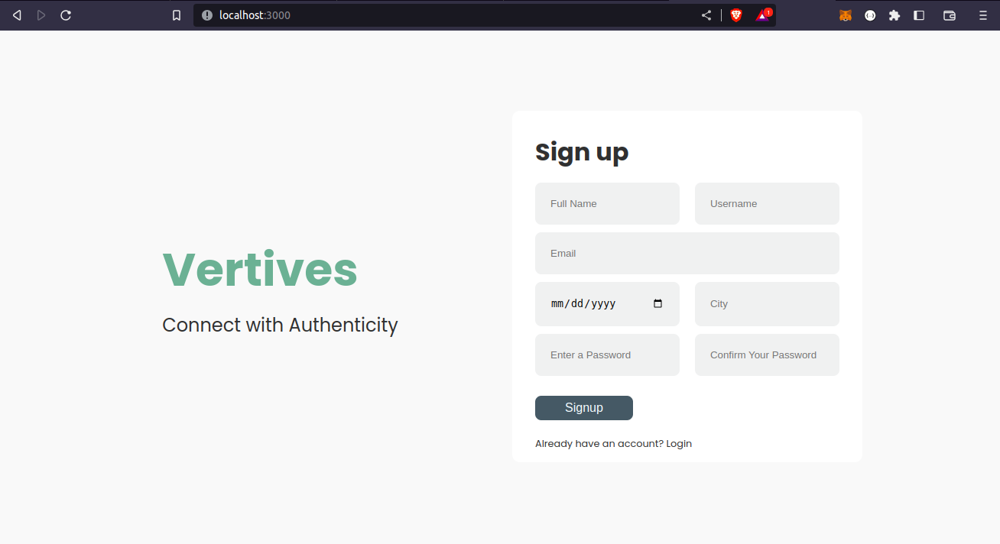
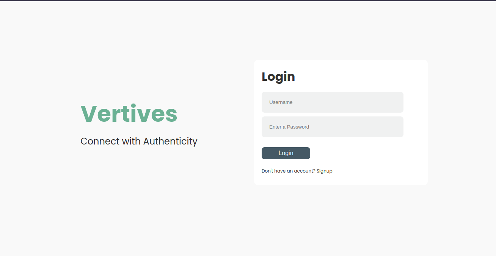
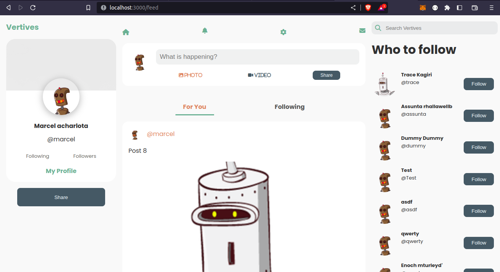
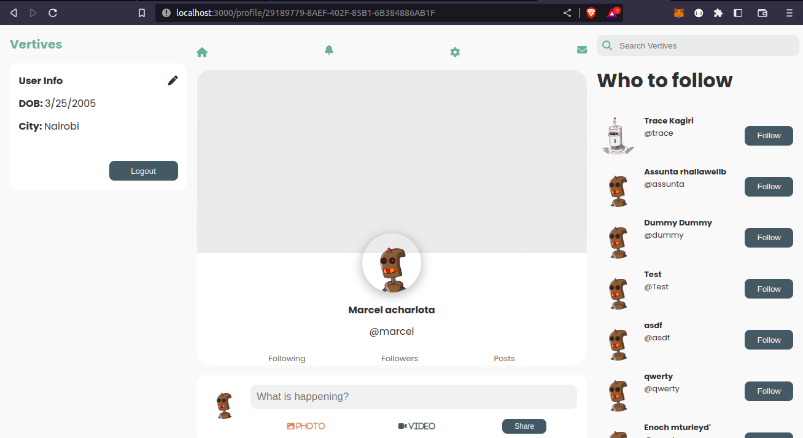
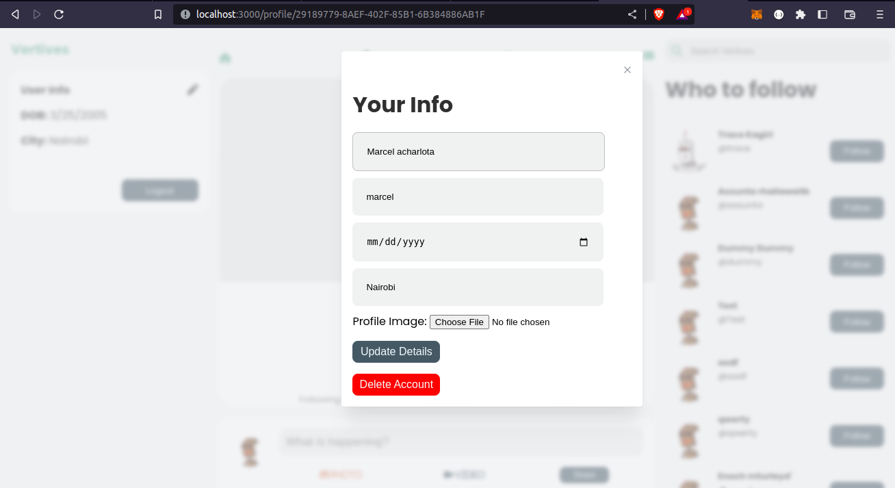
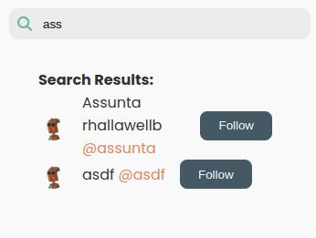
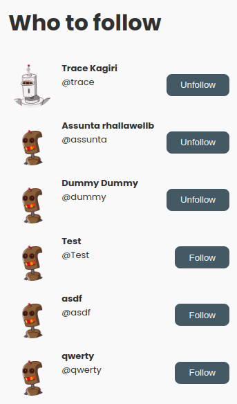

# Vertives Social App


## Description

Vertives is a social media application that I worked on as I was learning fullstack development. I followed a microservice architecture in this project.

All the stored procedures and triggers can be found in the respective database folders.

Feel free to play around with it. I'm open to your contributions to make it better.

### Signup Page



### Login Page



### HomePage/Feed



### Profile Page



### Profile Settings Page



### Search Results



### Follow/Unfollow



## Prerequisites

In order to use this repository, you will need to have the following setup in your computer.


- `node v18.16.0`
- `npm 9.5.1`
- [SQL Server](https://www.microsoft.com/en-us/sql-server/sql-server-downloads)
- [Azure Data Studio](https://learn.microsoft.com/en-us/sql/azure-data-studio/download-azure-data-studio?view=sql-server-ver16&tabs=redhat-install%2Credhat-uninstall) (Preferred for interacting with the database)

## Setup Instructions

This section will guide you through setting up and running this repository on your local machine.

### Project

- Clone the repository
  ```
  git clone git@github.com:emmanuelkaringi/vertives-social-app.git
  ```
- Navigate to the project folder
  ```
  cd vertives-social-app
  ```
- To interact with the back-end part of the application, navigate to the `server` folder
  ```
  cd server
  ```
- To interact with the front-end part of the application, navigate to the `client` folder
  ```
  cd client
  ```
- Setup a database, most preferably with SQL Server (MsSQL). The `object.sql` contains the database schema.

### Environment Variables

To use the environment variables, create an environment file: `.env` in each microservice `auth`, `user`, `post` and one more for the `client`.

#### Example of backend `.env` file:

```
DB_USER="name"
DB_PWD="password"
DB_NAME="name-db"
DB_SERVER="localhost"
PORT=4000 //Each microservice should use a different port.
SECRET_KEY="MyPassw0rd!"

//Only needed in the auth service for sending emails after signups.

EMAIL_USER="your email"
EMAIL_PWD="pass"
```

#### Example of frontend `.env` file:

```
REACT_APP_CLOUDINARY_NAME="name"
REACT_APP_CLOUDINARY_API_KEY="key"
REACT_APP_CLOUDINARY_API_SECRET="secret"
REACT_APP_CLOUDINARY_PRESENT_NAME="name"
```

## Technologies Used

This application has been built with these technologies:

- SQL Server (MsSQL)
- React `v18.0`
- CSS
- Express/node
- [Cloudinary](https://cloudinary.com/)
- GitHub Projects

## Authors

- [Emmanuel Kariithi](https://github.com/emmanuelkaringi)

## License

[](https://opensource.org/licenses/MIT)

```
MIT License

Copyright (c) 2023 Emmanuel Kariithi

Permission is hereby granted, free of charge, to any person obtaining a copy of this software and associated documentation files (the “Software”), to deal in the Software without restriction, including without limitation the rights to use, copy, modify, merge, publish, distribute, sublicense, and/or sell copies of the Software, and to permit persons to whom the Software is furnished to do so, subject to the following conditions:

The above copyright notice and this permission notice shall be included in all copies or substantial portions of the Software.

THE SOFTWARE IS PROVIDED “AS IS”, WITHOUT WARRANTY OF ANY KIND, EXPRESS OR IMPLIED, INCLUDING BUT NOT LIMITED TO THE WARRANTIES OF MERCHANTABILITY, FITNESS FOR A PARTICULAR PURPOSE AND NONINFRINGEMENT. IN NO EVENT SHALL THE AUTHORS OR COPYRIGHT HOLDERS BE LIABLE FOR ANY CLAIM, DAMAGES OR OTHER LIABILITY, WHETHER IN AN ACTION OF CONTRACT, TORT OR OTHERWISE, ARISING FROM, OUT OF OR IN CONNECTION WITH THE SOFTWARE OR THE USE OR OTHER DEALINGS IN THE SOFTWARE.
```

Copyright (c) 2023 **Emmanuel Kariithi**
